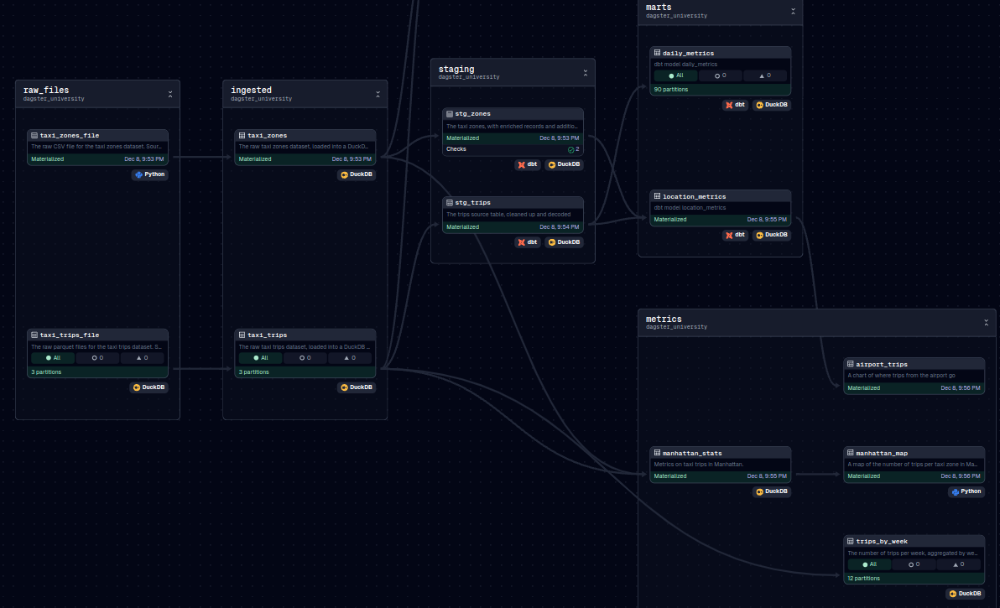

# dagster-dbt



```bash
cd dagster-and-dbt
cp .env.example .env
python3 -m venv .venv
. .venv/bin/activate
pip install -e ".[dev]"
dagster dev
```

```bash
cd analytics
dbt deps
dbt build
dbt parse
```